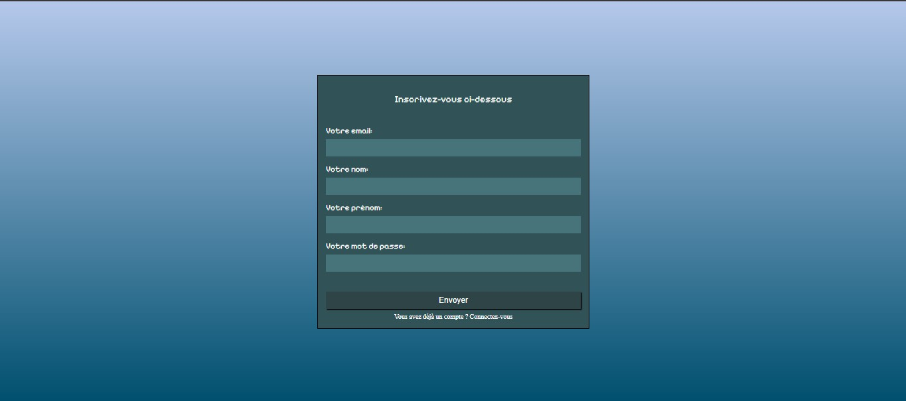
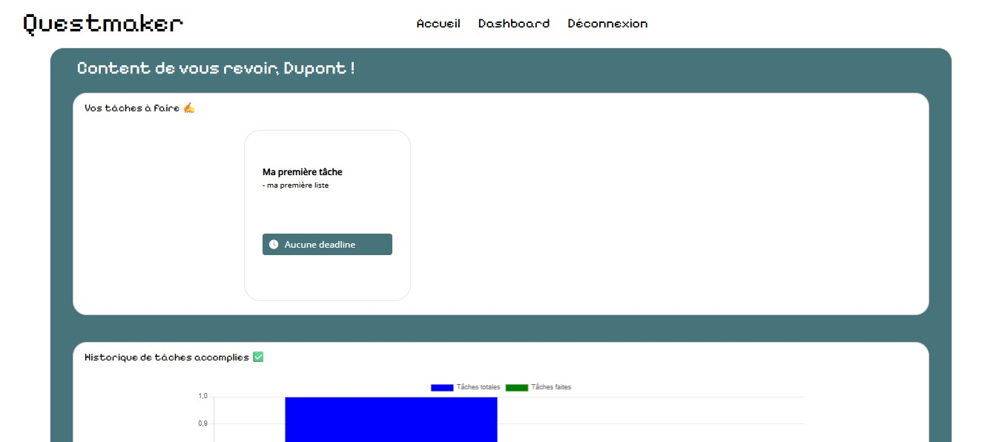
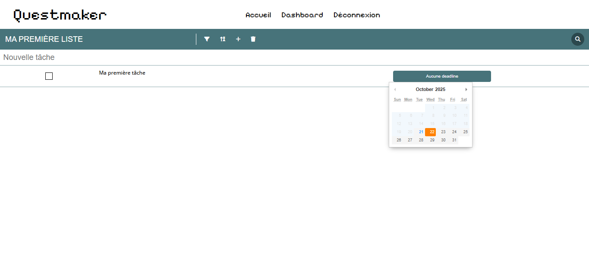
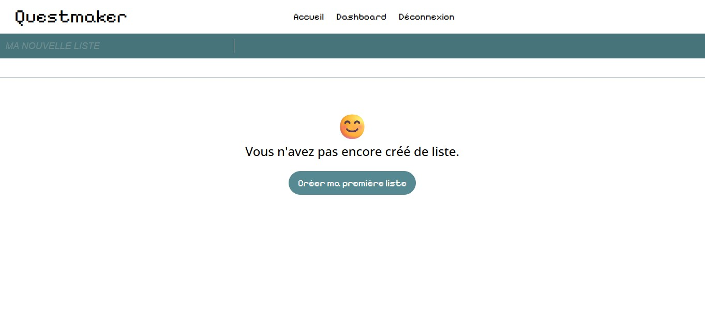
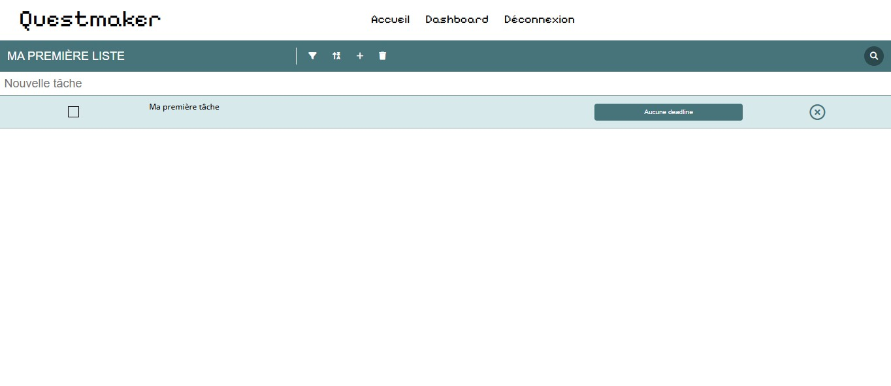
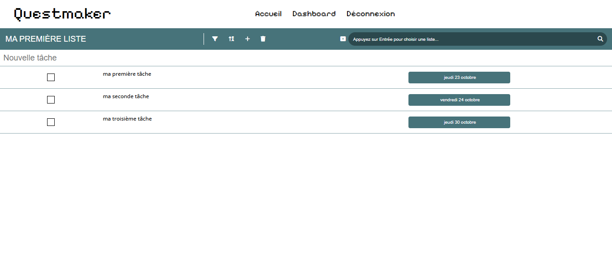
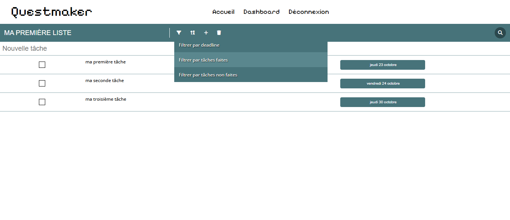

# 🌟 QuestMaker

QuestMaker is a **gamified web to-do list application**, inspired by Trello and Notion, featuring a **retro pixel theme**.  
Its goal: to transform task management into a quest system, making productivity more engaging and playful.

---

## 🚀 Features

✅ Create, edit, and delete tasks (habits, daily quests, short-term goals)  
📅 Deadline management using **Pikaday** (date picker)  
📊 Progress tracking with **Chart.js**  
🔐 Login/Logout system (**PHP + SQL + localStorage**)  
🎨 Retro visual theme with pixel-style fonts  

---

## 🛠️ Tech Stack

| Layer       | Technology |
|--------------|-------------|
| Frontend     | HTML, CSS, JavaScript |
| Backend      | PHP, SQL |
| Libraries    | Moment.js, Pikaday, Chart.js |

---

## 🏗️ Project Structure

```bash
bdd/ → contains the exported SQL database
php/ → backend PHP API files (authentication, CRUD operations)
scripts/ → JavaScript logic (tasks, filters, chart updates, UI behavior)
styles/ → CSS files for layout and retro styling
screenshots/ → app previews and demo images
index.php → main entry point
dashboard.php → task management dashboard
profil.php → user profile page
```
---

## 📸 Aperçu









---

## 🎯 Project Goals

This project was designed to:

- Deepen my understanding of **JavaScript**, **PHP/SQL**, and **DOM manipulation**  
- Explore the integration of **external libraries** (date picker, charts, time management tools)  
- Experiment with **gamification principles** in task management  
